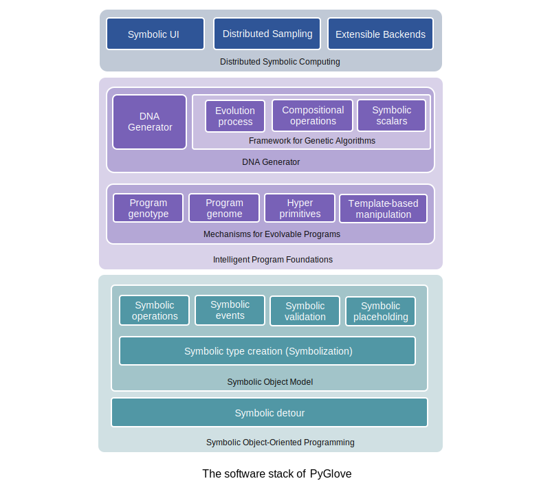

Learning PyGlove
################

.. PyGlove is organized into three layers: 

.. * At the bottom, the layer of symbolic object-oriented programming, enables a mutable
..   programming model with objects, which allows unknown program parts to be expressed
..   side-by-side with the expression of known program parts, and enables dynamic interpretations
..   on them.
.. * At the middle, the layer of intelligent programs, provides the representation
..   and operations to convert between symbols and numbers. It also introduces the expression for
..   feedback loops, as well as a framework for building algorithms that evolve the program.
.. * At the top, the layer of distributed symbolic computing, introduces API to allow
..   feedback loops to be distributed so that intelligent programs can run at scale. This layer
..   also provide the interfaces for the user to plug in their own infrastructures into PyGlove.

PyGlove is a library for manipulating Python programs and is divided into three sub-systems: 
the bottom layer for symbolic object-oriented programming, the middle layer for
building symbolic intelligence, and the top layer for distributed symbolic computing.

.. toctree::
   :maxdepth: 1

   SOOP <soop/index>
..  intelligence/index
..  distributed/index

|

