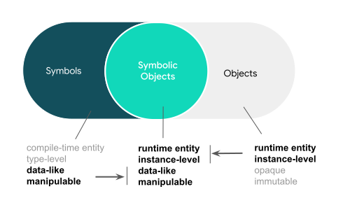
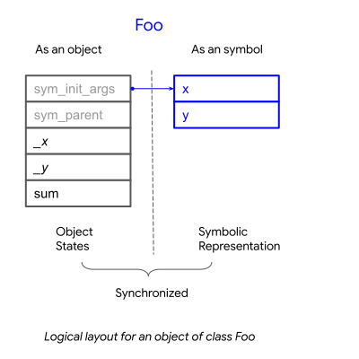

Symbolic Object
===============

A symbolic object is a Python object that can be symbolically programmed. 
It has the characteristics of a regular object, such as data members and methods
that can be accessed and executed at runtime. Additionally, it also functions as
a symbolic representation, allowing it to be manipulated as a node in the symbolic
tree.
 

In another words, a symbolic object can be both manipulated and executed.
The two aspects are always in sync, meaning that when the object is manipulated,
its states are adjusted accordingly to maintain consistency.

Symbolization
-------------

Symbolic objects are instances of symbolic types in PyGlove. PyGlove allows for
the creation of new symbolic types as well as extending existing types with symbolic
programmability. This process is called *symbolization*.
:func:`pg.symbolize <pyglove.symbolic.symbolize>` is the API for symbolization::

    @pg.symbolize
    def foo(x, y):
      return x + y

    # `f` is an instance of `foo`,
    # which is a symbolic object representing a bound function
    f = foo(1, 2)

    @pg.symbolize
    class Foo:

      def __init__(self, x, y)
        self._x = x
        self._y = y

      def sum(self):
        return self._x + self._y

    # `f` is an instance of `Foo`
    # which is also a symbolic object.
    f = Foo(1, 2)

:func:`pg.symbolize <pyglove.symbolic.symbolize>` allows for various options,
such as enabling symbolic validation and using symbolic equality as the default
comparison method. Symbolic classes can also be created by subclassing
:class:`pg.Object <pyglove.symbolic.Object>`.
For more details on developing symbolic types, please see :doc:`types`.

Logical Layout
--------------

A symbolic object carries *symbolic attributes*, which are stored argument values from ``__init__``, 
as the symbolic representation for the object. When any of the symbolic
attribute get modified, PyGlove recomputes the object states based on the latest symbolic
attributes. To notify the containing object when it's modified, a symbolic object also
maintains a reference to its parent object. The logical layout of a symbolic object can be
illustrated as the following:

Symbolic Tree
-------------

A symbolic attribute is usually a value of simple type (e.g. :class:`int`, :class:`str``) or a reference
to another symbolic object. When multiple symbolic objects are linked together in this way, it forms
a tree-like structure of symbols. Each object in the tree is identified by a unique
combination of keys, which we call a *key path* (:class:`pg.KeyPath <pyglove.object_utils.KeyPath>`).
Key paths can be used to navigate and manipulate specific nodes in the symbolic tree::

    @pg.symbolize
    def node(value, children=None):
        pass

    tree = node(1, [
        node(2, [node(3), node(4)]),
        node(5, [node(6), node(7)])
    ])

    # Mutate a tree by key paths.
    tree.rebind({
        # Mutate the root node's value from 1 to 8.
        'value': 8,

        # Mutate the first grand child node's value from 3 to 9.
        'children[0].children[0].value': 9,
    })

Values of Symbolic Attributes
^^^^^^^^^^^^^^^^^^^^^^^^^^^^^
Users are not required to use *symbolic values* for symbolic attributes, but it is recommended.
Symbolic values refer to values of basic Python types (such as booleans, strings, integers, and floats),
symbolic objects, or lists, tuples, and dictionaries whose elements are symbolic values. For example, users can
pass a lambda function to a symbolic attribute that accepts callable objects, However, using symbolic
values for all nodes in a tree provides benefits like supporting symbolic comparison and serialization::

  @pg.members([
    ('x', pg.typing.Callable([pg.typing.Int()]))
  ])
  class Foo(pg.Object):
    pass
  
  # Acceptable.
  f = Foo(x=lambda v: v ** 2)
  f2 = Foo(x=lambda v: v ** 2)
  # Fails: since two lambda functions are not equal, even they share the same definition.
  assert pg.eq(f, f2)
  # Raises: as lambda function is not serializable by PyGlove.
  pg.to_json_str(f)

  # Recommended.
  @pg.symbolize
  def square(v):
    return v ** 2
  
    g = Foo(x=square.partial())
  g2 = Foo(x=square.partial())
  # Succeeds.
  assert pg.eq(g, g2)
  # Succeeds.
  assert pg.from_json_str(pg.to_json_str(g)) == g

.. For example, a ``lambda`` function can
.. be passed as an argument to create a symbolic object. Besides symbolic objects,
.. Python types such as :class:`bool`, :class:`str`, :class:`int`, :class:`float` are symbolic values too;
.. :class:`list`, :class:`tuple` and :class:`dict` are also symbolic values if they only
.. contain symbolic values as child nodes.

Pass-by-value vs. Pass-by-reference
^^^^^^^^^^^^^^^^^^^^^^^^^^^^^^^^^^^

To ensure that changes made to a symbolic object are reflected in the states of its parent objects,
each symbolic object maintains a reference to its parent node. To maintain the single-parent
premise, copies must be obtained when a symbolic object is referenced in multiple places.
These copies will serve as the values for the new references, maintaining a symbolic tree
rather than a directed acyclic graph (DAG). This approach simplifies the programming model
and ensures that nodes in the symbolic tree are treated as representations rather than program
states. When state needs to be shared among copies, the `Flyweight`_ pattern can be used.

In contrast to symbolic objects, non-symbolic objects are always passed by references.
For example::

  n = node(1)
  l = pg.List()

  # `n` will be used as the first element since it does not have a container yet.
  l.append(n)

  # `n` will be copied and the new value will be appended.
  l.append(n)

  assert n is l[0]
  assert n is not l[1]

  class X:
    pass
  
  x = X()
  # Both append will use `x` as reference since `X` is not symbolic.
  l.append(x)
  l.append(x)

  assert x is l[0]
  assert x is l[1]

.. _`Flyweight`: https://en.wikipedia.org/wiki/Flyweight_pattern

Automatic ``list``/``dict`` Conversion
^^^^^^^^^^^^^^^^^^^^^^^^^^^^^^^^^^^^^^

A symbolic object may take list-type or dict-type symbolic attributes. For example, in the code
above, `node.children` is a list-type attribute for storing immediate child nodes. In order for
PyGlove to propagate changes upward along the containing hierarchy, :class:`list` and :class:`dict`
objects will be automatically converted to their symbolic counterparts, which are
:class:`pg.List <pyglove.symbolic.List>` and :class:`pg.Dict <pyglove.symbolic.Dict>` respectively.
For example, `tree.children` is an instance of ``pg.List`` instead of ``list``.

Programming Properties
----------------------

Symbolic objects have several useful programming properties. This section will demonstrate these
properties by comparing programs with and without symbolic objects.

Symbolic
^^^^^^^^

A regular object is created by evaluating its class' ``__new__`` method. Once the evaluation is finished, 
the binding between the type and values is lost. For example, after the evaluation of ``Foo(1)``, the
value `1` that was associated with the class ``Foo`` in the creation of the object `f` is no longer
accessible::

    class Foo:

      def __init__(self, x):
        self._value = x + 1

    # The value used for creating `f` is not accessible beyond this point.
    f = Foo(1)

In contrast, a symbolic object maintains the binding information throughout its lifetime, which can be
accessed through its symbolic attributes. For example, the value of the argument `x`` can be retrieved
as a symbolic attribute as follows::

    SymbolicFoo = pg.symbolize(Foo)

    f = SymbolicFoo(1)

    # Returns 1.
    f.sym_init_args.x

"Symbolic" refers to the ability to use the binding information to achieve advanced programming
capabilities. This allows a symbolic object to be used for various purposes such as:

  * **Locating** a symbolic object within its symbolic tree::
  
        print(f.sym_path)

  * **Traversing** the sub-nodes of a symbolic object::

        def visit(path, value, parent):
          print(path, value)
        pg.traverse(f, visit)
    
  * **Printing** a symbolic object in human-readable format::

        print(f)
  
  * **Comparing, hashing and differentiating** symbolic objects based on their representations::
  
        assert pg.eq(f, SymbolicFoo(1))
        assert pg.hash(f) == pg.hash(SymbolicFoo(1))
        print(pg.diff(f, SymbolicFoo(2)))

  * **Replicating** a symbolic object::
  
        pg.clone(f)

  * **Serializing and deserializing** a symbolic object::
  
        json_str = pg.to_json_str(f)
        assert pg.eq(f, pg.from_json_str(f))

  * **Mutating** a symbolic object::

        f.rebind(x=2)
        self.assert f._value == 3

  * **Encoding and decoding** a symbolic object relative to a search space::

        f_space = SymbolicFoo(pg.oneof([1, 3, 5]))
        assert pg.encode(f_space, SymbolicFoo(3)) == pg.DNA(1)
        assert pg.materialize(f_space, pg.DNA(1)) == SymbolicFoo(3)

For more operations, see :doc:`operations`.

Abstract
^^^^^^^^

Regular objects are concrete, meaning that their arguments must be provided and their
values must conform to the constructor's expectations. On the other hand, symbolic
objects can be *abstract*, with arguments that may be only partially specified or represented
by *pure symbolic* values (defined by interface :class:`pg.PureSymbolic <pyglove.symbolic.PureSymbolic>`).

For example, ``foo`` is a partial object of ``Foo``::

    @pg.symbolize
    class Foo:
      def __init__(self, x, y)
        self.z = x * y

    # `partial` method must be called for creating an partial object
    # from a symbolic class.
    # `foo` is partial since the argument for `y` is not provided.
    foo = Foo.partial(x=1)

    assert pg.is_partial(foo)
    assert pg.is_abstract(foo)

And ``foo_space`` is pure symbolic due to it's placeheld by :func:`pg.oneof <pyglove.hyper.oneof>`::

    # `foo_space` is a space of `foo` objects.
    foo_space = Foo(pg.oneof([1, 2, 3]), pg.oneof([4, 5]))

    assert pg.is_pure_symbolic(foo_space)
    assert pg.is_abstract(foo_space)

An abstract symbolic object cannot be evaluated until its missing or placeholder
arguments are replaced with concrete values. As such, an abstract symbolic object
can only be used for symbolic manipulation and not for evaluation::

    # Raises: required argument `y` is missing.
    foo.z

    foo.y = 2
    # Okay: `y` is now provided, thus `foo.z` get computed.
    foo.z

    # Raises: `foo_space.z` is not yet assigned as `x` and `y`
    # are still pure symbolic.
    foo_space.z

    # Obtain a material `Foo` from the `foo_space`.
    foo1 = pg.materialize(foo_space, pg.DNA([0, 1]))

    # Okay: `foo1` is bound with x=1, y=5.
    foo1.z

.. important::

   Abstract symbolic objects are an essential aspect of symbolic object-oriented
   programming. They enable the programmer to incorporate high-level descriptions
   into a program and substitute them with concrete values later on. This allows
   for the creation of domain-specific languages (such as :func:`pg.oneof <pyglove.hyper.oneof>`) with ease.
   This makes the programming language more extensible and higher-level by separating
   the expression of ideas (the whats) from the implementation of ideas (the hows).

   See :doc:`placeholding` for more details about pure symbolic, partial and abstract objects.

Symbolically Validated
^^^^^^^^^^^^^^^^^^^^^^
When a symbolic object is abstract, the call to its ``__init__`` will be delayed. Therefore,
we cannot depend on the user validation logics to perform value check when an abstract
object is created. However, the programmer can still catch invalid arguments as soon
as the object is created or modified, other than to wait until the object is evaluated.
Therefore, symbolic objects are validated based on the rules declared alongside with the
*symbolic fields*, which defines the acceptable keys and values for symbolic attributes.
We call such validation mechanism *symbolic validation*. For example, for a regular class
which validates its input as the following::

  class Foo:
    def __init__(self, x):
      if x < 0:
        raise ValueError('`x` should be non-negative.')
      self.x = x

the symbolic validation rule will be defined as::

  @pg.symbolize([
      ('x', pg.typing.Int(min_value=0))
  ])
  class Foo:
    def __init__(self, x):
      self.x = x

Aside from the necessity to trigger validation upon creation and modification,
symbolic validation has the following benefits:

 * It eliminates boilerpated code for argument validation, allowing the develoeprs
   to focus on the core program logic.
 * The validation rules define both acceptable types and their values, which
   removes the need of documenting them in the doc string. Also comparing to the
   validation logics from ``__init__``, they describe the rules at higher abstract
   level, and are thus more readable. (e.g. see the ``kernel_size_spec`` below)
 * The validation rules are reusable across class definitions. 
   Therefore, developers can create modular validation rules that are consistent
   throughout the software system::

    def kernel_size_spec()
      """Kernel size is a positive integer or a pair of positive integers."""
      return pg.typing.Union([
          pg.typing.Int(min_value=1),
          pg.typing.Tuple([
              pg.typing.Int(min_value=1),
              pg.typing.Int(min_value=1)
          ])
      ])

    @pg.symbolize([
        ('kernel_size', kernel_size_spec())
    ])
    def conv2d(kernel_size):
      pass
    
    @pg.symbolize([
        ('pool_size', kernel_size_spec())
    ])
    def maxpool(kernel_size):
      pass

Deeply Mutable
^^^^^^^^^^^^^^

While regular objects are not mutable, symbolic objects are. For example,
we cannot change or even access the bound argument `x` once `foo` is created::

    class Foo:
      def __init__(self, x):
        self.value = x ** 2

    foo = Foo(x=1)

However, we can mutate `x` with its symbolic counterpart::

    SymbolicFoo = pg.symbolize(Foo)

    foo = SymbolicFoo(x=1)
    assert foo.value == 1
    
    # `foo` will be `SymbolicFoo(2)` after rebinding.
    foo.rebind(x=2)

    # the internal state is recomputed
    # when the binding information is modified.
    assert foo.value == 4

There are two highlights in symbolic objects' mutability:

  * **Strong consistency**: Updates to symbolic attributes will cause the symbolic object
    to become invalid, triggering recomputation or adjustment of its internal states.
    This not only occurs on the modified object itself, but also on the containing objects
    along the object hierarchy. This process is important to ensure that the object and its
    related objects remain in a consistent and correct state::

     @pg.members([
       ('x', pg.tying.Int())
     ])
     class Foo(pg.Object):
        pass
      
     @pg.members([
       ('y', pg.typing.Object(Foo))
     ])
     class Bar(pg.Object):
       
       def _on_bound(self):
         super()._on_bound()
         self.z = self.y.x

     foo = Foo(1)
     bar = Bar(foo)
     assert foo.x == 1
     assert bar.z == 1
     
     # Manipulation on child symbolic objects will cause
     # the parent symbolic objects to recompute their internal states.
     foo.rebind(x=2)
     assert bar.z == 2

  * **Deep manipulability**: Given a symbolic object, the user can manipulate
    not only its immediate children, but also the children of its children, and so on.
    For example::

      bar.rebind({
          'y.x': 2
      })
      assert foo.x == 2

Contextual
^^^^^^^^^^

One of the consequences of the mutability of symbolic objects is that they are also contextual.
To maintain consistency of state, changes made to child objects must inform their parent objects
to recalculate their state. As a result, each symbolic object has knowledge of its parent and
its location within the containing symbolic tree. Users can
subscribe to the :meth:`_on_parent_change <pyglove.symbolic.Object._on_parent_change>`
event and :meth:`_on_path_change <pyglove.symbolic.Object._on_path_change>`
events to handle context changes::

    
    class ContextAwareFoo(pg.Object):

      def _on_parent_change(self, old_parent, new_parent):
        super()._on_parent_change(old_parent, new_parent)
        print('Parent has changed', old_parent, new_parent)
        
      def _on_path_change(self, old_path, new_path):
        super()._on_path_change(old_path, new_path)
        print('Location has changed', old_path, new_path)

    f = ContextAwareFoo()
    # `f._on_parent_change` will be triggered: from None to `x`;
    # `f._on_path_change` will also be triggered: from '' to 'a';
    x = pg.Dict(a=f)

    # `f._on_path_change` will be triggered: from 'a' to '[0].a'.
    y = pg.List([x])

    # `f._on_parent_change` will be triggered: from `x` to None;
    # `f._on_path_change` will also be triggered: from 'a' to '';
    x.clear()

See :doc:`events` for more details.

Better Software Design
^^^^^^^^^^^^^^^^^^^^^^

Using symbolic objects can lead to a more object-oriented software design and better utilize the composability of reusable building blocks.

More Object Oriented
""""""""""""""""""""

PyGlove promotes the use of symbolic functions, which are classes that align the programming style
between classes and functions, resulting in more consistent object bindings::

    @pg.symbolize
    def bar(y):
      return y ** 2
    
    @pg.members([
      ('x', pg.typing.Int()),
      ('y', pg.typing.Object(bar))
    ])
    class Foo(pg.Object):
      pass
    
    Foo(1, bar(2))

Better Compositionality
"""""""""""""""""""""""

The use of symbolic objects leads to more hierarchical bindings, which enables the creation
of large-scale compositions using smaller, reusable building blocks.

Functions use arguments to customize its behaviors defined in the function
body, which oftentimes call other functions. Therefore, when we need to control
the behaviors at deeper levels, we need to pass down the arguments across the
call hierarchy (let's ignore globals in such analysis as it is not among the
best practices). For example, in order to customize ``bar``'s behavior inside
``foo``, ``y`` needs to be passed down through ``foo``::

    def foo(x, y)
      return x + bar(y)

If we need to further control the function to be called within ``foo``, we will
need to modify the signature of ``foo`` as follows::

    def foo(x, bar_fn, y):
      return x + bar_fn(y)

This leads to a flat binding. For a program that uses functions extensively,
flat bindings can lead to a long argument list at outer scopes. As a result,
the program becomes either less reusable (with a short arg list) or
less usable (with a long arg list).

However, with classes the program bindings become hierarchical, which allows
a large number of binding parameters to be specified in semantic groups 
without sacrificing usability::

    def foo(x, bar):
        return bar()

    class Bar:
    
      def __init__(self, y):
        self.y = y

      def __call__(self):
        return self.y

    foo(x, Bar(y))

